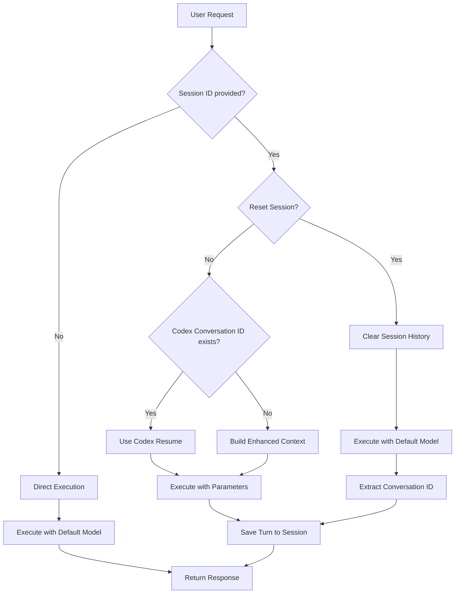

# Session Management Implementation Guide

## Overview
The Codex MCP Server provides advanced session management with native Codex CLI v0.50.0+ integration, enabling persistent conversational context and sophisticated AI coding assistance.

## Architecture

### Session Storage
- **In-memory Map-based storage** with automatic cleanup
- **UUID-based session IDs** for unique identification
- **TTL management** - 24 hour automatic session expiration
- **Session limit enforcement** - maximum 100 concurrent sessions

### Enhanced Session Data Structure
```typescript
interface SessionData {
  id: string;
  createdAt: Date;
  lastAccessedAt: Date;
  turns: ConversationTurn[];
  codexConversationId?: string; // Native Codex conversation ID
}

interface ConversationTurn {
  prompt: string;
  response: string;
  timestamp: Date;
}
```

### Native Codex Integration
- **Automatic conversation ID extraction** from Codex CLI output
- **Resume functionality** using `codex resume <conversation-id>`
- **Fallback context building** when native resume unavailable
- **Model consistency** across session interactions

### Tool Enhancements

#### Enhanced Codex Tool
- **sessionId** (optional): Session ID for conversational context
- **resetSession** (optional): Reset session history before processing
- **model** (optional): Model selection (defaults to `gpt-5.1-codex`)
- **reasoningEffort** (optional): Control reasoning depth (low/medium/high)
- **Smart context building**: Uses native resume or fallback context
- **Robust error handling**: Graceful degradation for various failure modes

#### ListSessions Tool
- **Session enumeration**: Returns all active session IDs with comprehensive metadata
- **Session introspection**: Creation time, last access, turn count, conversation ID
- **Management interface**: Enables session lifecycle monitoring

## Implementation Status ✅

### ✅ Completed Features
1. **Session Storage System**
   - InMemorySessionStorage with TTL and cleanup
   - Defensive programming against data corruption
   - Conversation ID tracking and management

2. **Enhanced Codex Tool Handler**
   - Native resume functionality with fallback
   - GPT-5-Codex as intelligent default model
   - Model and reasoning effort parameter support
   - Comprehensive error handling and validation

3. **ListSessions Tool**
   - Complete session metadata exposure
   - JSON-formatted session information
   - Real-time session status tracking

4. **Robust Testing Suite**
   - 54 comprehensive tests covering all functionality
   - Edge case handling and error scenario validation
   - Integration testing with Codex CLI interactions

## Advanced Benefits
- **Native Codex Resume**: Optimal conversation continuity using Codex CLI's built-in resume feature
- **Intelligent Defaults**: GPT-5-Codex model selection for superior coding assistance
- **Production-Ready**: Comprehensive error handling, data validation, and graceful degradation
- **Enterprise-Scale**: Session management suitable for professional development workflows
- **Flexible Configuration**: Per-request model and reasoning effort customization

## Usage Patterns

### Basic Session Usage
```bash
# Automatic session creation with optimal defaults
codex "Analyze this authentication system"

# Explicit session management
codex --sessionId "auth-review" "Continue analysis"
codex --sessionId "auth-review" --resetSession true "Start fresh review"
```

### Advanced Configuration
```bash
# Model and reasoning control
codex --model "gpt-4" --reasoningEffort "high" "Complex architectural analysis"

# Session with custom parameters
codex --sessionId "deep-dive" --model "gpt-4" --reasoningEffort "high" "Advanced optimization review"

# Session management
listSessions  # View all active sessions
```

## Technical Architecture

### Command Flow


### Error Handling Strategy
- **Graceful Degradation**: System continues operation even with corrupted session data
- **Defensive Programming**: Validates array structures and handles null/undefined gracefully
- **Comprehensive Logging**: Error context preserved for debugging and monitoring
- **Fallback Mechanisms**: Manual context building when native resume fails

### Performance Considerations
- **Memory Management**: Automatic cleanup of expired sessions (24hr TTL)
- **Session Limits**: Maximum 100 concurrent sessions to prevent memory exhaustion
- **Context Optimization**: Only recent turns (last 2) used for manual context building
- **Efficient Storage**: Minimal session metadata for optimal memory usage